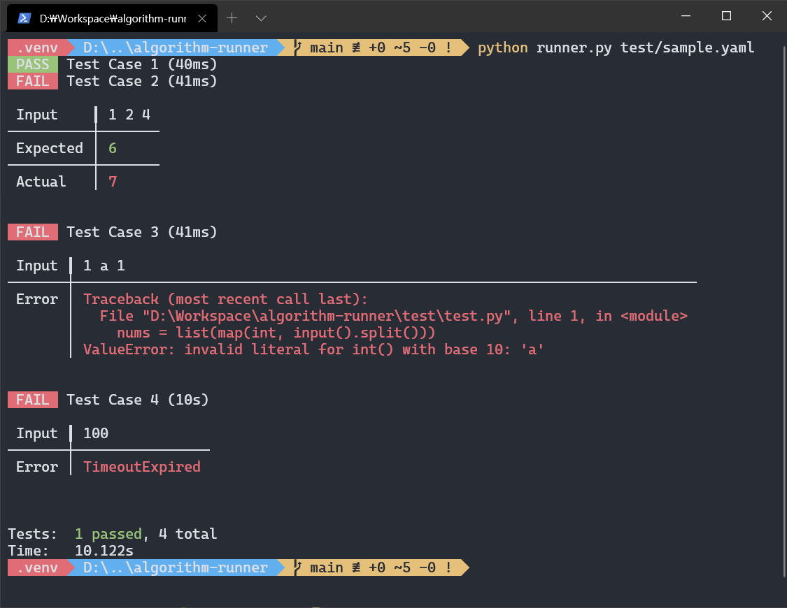

# algorithm-runner

> 시스템 입/출력을 사용하는 알고리즘 스크립트를 테스트하기 위한 Runner

<p align="center">

</p>

## 사용방법

```bash
usage: runner.py [-h] config

positional arguments:
  config

optional arguments:
  -h, --help  show this help message and exit
```

## 설치

1. 이 저장소를 원하는 경로에 클론합니다.
2. 클론한 위치에서 아래의 명령어로 필요한 라이브러리들을 설치합니다.
   
   ```
   pip install -r requirements.txt
   ```

3. Runner 실행을 위한 yaml 파일을 작성합니다.
   
    ```yaml
    script: python test.py
    context:
      timeout: 10
    tests:
      - input: |
          1 2 3
        output: |
          6
      - input: |
          1 2 4
        output: |
          6
      - input: |
          1 a 1
        output: |
          2
    ```

## Yaml Schema

```yaml
script:
  - [string]
  - build: [optional/string]
    run: [string]
    clean: [optional/string]
context:
  timeout: [optional/integer]
  workdir: [optional/string]
tests:
  - input: [string]
    output: [string]
```

### script

Runner가 수행할 스크립트 내용을 작성합니다.  
스크립트 내용은 필요에 따라 여러 형태로 작성이 가능합니다.

```yaml
script: python test.py

# 이는 다음과 같습니다.

script:
  - python test.py
```

빌드 및 빌드 이후 작업이 필요한 경우
테스트 수행 시 run 스크립트만 실행하여 테스트합니다.

```yaml
script:
  build: gcc test.c test.out
  run: ./test.out
  clean: rm -rf test.out

# 이는 다음과 같습니다.

script:
  - build: gcc test.c test.out
    run: ./test.out
    clean: rm -rf test.out
```

여러 스크립트 파일을 사용하는 경우

```yaml
script:
  - python test.py
  - node test.js
```

### context

Runner가 테스트 수행 시 사용할 옵션들을 포함

- workdir
  
  Runner가 스크립트를 수행할 Working Directory  
  값이 비어있을 경우 스크립트가 위치한 폴더를 사용

  ```yaml
  context:
    workdir: test/
  ```

- timeout

  Runner가 스크립트 수행 시 timeout 시간(초)  
  이 값을 지정하면 스크립트 수행 시 해당 시간을 초과할 떄 `TimeoutExpired` 에러를 출력합니다.

  ```yaml
  timeout: 10
  ```

### tests

Runner가 수행할 테스트 케이스

이 속성은 반드시 리스트로 작성해야 하며 각 리스트의 항목은 입력은 `input`, 입력에 따른 예상 결과는 `output`에 작성해야 합니다.

```yaml
tests:
    - input: |
        1 2 3
      output: |
        6
    - input: |
        1 3 3
      output: |
        7
```

입/출력은 여러 줄로 작성할 수 있습니다.

```yaml
tests:
    - input: |
        1 2 3
        5 6 7
      output: |
        6
        18
```